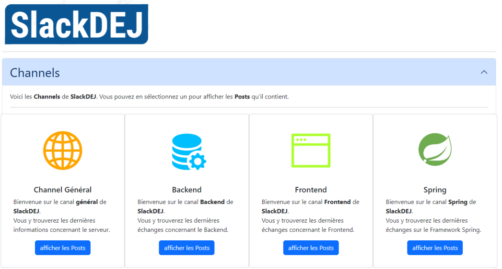
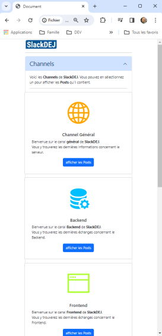

# projetSlackDEJ

## Projet d'étude Dame, Eric, Jérôme. POE JAVA FULL STACK Réalisation et présentation devant Jury.

## Le projet à réaliser :

* Une application de tchat en ligne, en prenant  exemple sur Slack. 
* Pas d’authentification.
* Pas de sécurisation de l’API.
* Un seul espace de travail constitue la page d’accueil de l’application.
* Un canal général par défaut est actif. Il n’est pas possible de renommer ou supprimer le canal général.
* L’utilisateur doit pouvoir ajouter, renommer ou supprimer un canal.
* Dans chaque canal, l’utilisateur doit pouvoir ajouter des messages au format texte uniquement à l’aide d’un formulaire.
* Dans chaque canal, les messages s’affichent au format texte avec le nom d’un utilisateur statique, la date et l’heure à laquelle le message a été ajouté.
* Tous les canaux et leurs messages doivent être enregistrés en base de données.
* L’application doit être responsive.
* Le design de l’application est libre.

## Consignes et bonus :

* L’API et l’application tournent en local sur les machines des stagiaires le jour de la présentation, il n’est pas demandé de les mettre en ligne.
* L'option multi-utilisateurs impliquant l’utilisation d’un Websocket pour le temps réel n’est pas demandée.	
* L’utilisateur est créé côté Backend ou côté Frontend de manière statique dans le code.
* Toute fonctionnalité supplémentaire donnera lieu à des points bonus à l’ensemble du groupe y compris les 3 points énumérés juste ci-dessus.

## Conditions du passage :

* Par groupes de 2 ou 3, réaliser une application Web avec une API spring, Sql et MySql pour le Backend. Angular et Bootstrap pour le Frontend.
* Une présentation écrite devra servir de support à votre présentation orale suivie d’une démonstration de votre application. Cette présentation aura lieu le dernier jour du cursus devant un jury constitué de 3 jurés. Chaque stagiaire devra prendre la parole au cours de cette présentation.

## Chaque groupe devra présenter :

* Un power point
* Une démonstration de l’application et des fonctionnalités

## Durée de passage et déroulé :

* Chaque groupe prend la parole durant 25 à 30 minutes. 
* Cette présentation est suivie d’un échange questions réponses de 20 à 30  minutes avec les jurés.
 
## Notation et obtention de la certification :

* Les jurés évaluent chaque stagiaire dans un groupe à partir d’une grille d’évaluation sur 6 blocs de compétences (expression orale et écrite, blocs de compétences pour le Backend et blocs de compétences pour le Frontend). 
* Il faut avoir 50 points / 100 pour valider chaque bloc de compétence. 
* Il faut obtenir au moins 4 blocs pour avoir la certification.
